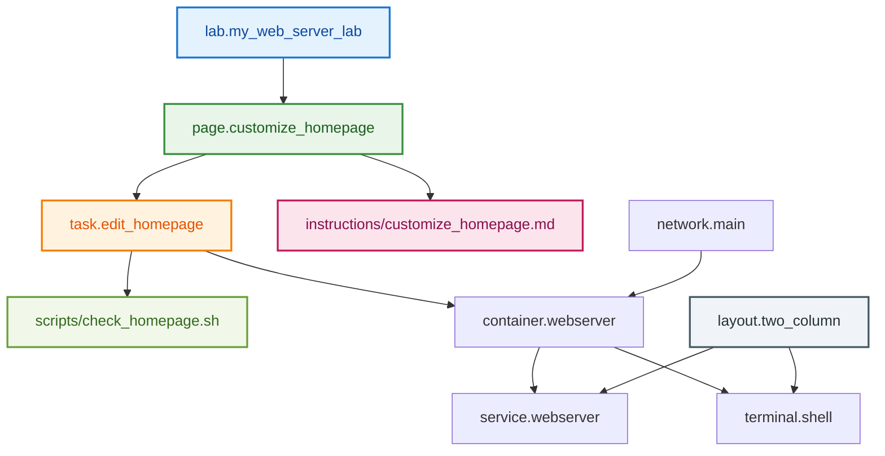

import { FileTree } from '@astrojs/starlight/components';

Add interactive tasks that validate user progress automatically.

## Tasks vs Content

**Content** provides instructions. **Tasks** verify completion through validation scripts.

## Create Your First Interactive Task

Add this task definition to `tasks.hcl`:

```hcl showLineNumbers title="tasks.hcl" {1-14}
resource "task" "edit_homepage" {
  config {
    target = resource.container.webserver
  }

  condition "file_modified" {
    description = "Customize the nginx homepage with your own message"
    
    check {
      script = "scripts/check_homepage.sh"
      failure_message = "Please edit /usr/share/nginx/html/index.html with your custom message"
    }
  }
}
```

Task structure:

- **`target`**: Connects task to the webserver container
- **`condition`**: Defines success criteria (file modification)
- **`check`**: Validation script path
- **`failure_message`**: Error guidance for users

## Build the Validation Script

Create the validation script directory and file:

```bash
mkdir -p scripts
```

In VS Code, create a new file `scripts/check_homepage.sh`:

```bash showLineNumbers title="scripts/check_homepage.sh" {1-10}
#!/bin/bash

EXPECTED_MESSAGE="Hello from my web server!"
NGINX_HTML="/usr/share/nginx/html/index.html"

if grep -q "$EXPECTED_MESSAGE" "$NGINX_HTML"; then
  exit 0
else
  exit 1
fi
```

Make the script executable:

```bash
chmod +x scripts/check_homepage.sh
```

## Create Interactive Tasks

The skeleton template provides basic structure. Now add interactive validation by creating a `tasks.hcl` file:

```hcl showLineNumbers title="tasks.hcl" {1-14}
resource "task" "edit_homepage" {
  config {
    target = resource.container.webserver
  }

  condition "file_modified" {
    description = "Customize the nginx homepage with your own message"
    
    check {
      script = "scripts/check_homepage.sh"
      failure_message = "Please edit /usr/share/nginx/html/index.html with your custom message"
    }
  }
}
```

Create the instruction content directory:

```bash
mkdir -p instructions
```

In VS Code, create a new file `instructions/customize_homepage.md` with this content:

`````markdown title="instructions/customize_homepage.md" {1-71} wrap
# Customize Your Web Server

Customize the nginx web server homepage.

## Task

Add the text "Hello from my web server!" to the nginx homepage.

## Step-by-Step Guide

1. **Explore the current homepage**
   
   Look at the **Service** tab to see the current nginx welcome page. This is what visitors see when they access your web server.

2. **Find the homepage file**
   
   In the **Terminal** tab, navigate to the nginx html directory and list the files:
   ```bash
   cd /usr/share/nginx/html
   ls -la
   ```
   
   The output will show `index.html` - this is the file that creates the homepage.

3. **Edit the homepage**
   
   Open the file in a text editor:
   ```bash
   nano index.html
   ```
   
   Add your custom message anywhere in the HTML. For example, you could add this line after the `<h1>` tag:
   ```html
   <p><strong>Hello from my web server!</strong></p>
   ```

4. **Save and exit**
   
   In nano:
   - Press `Ctrl + X` to exit
   - Press `Y` to confirm saving
   - Press `Enter` to confirm the filename

5. **Verify your changes**
   
   Refresh the **Service** tab to see your customized homepage!


## Testing Your Progress

<instruqt-task id="edit_homepage">
Check if you've successfully customized the homepage
</instruqt-task>

## What Happened

Editing `index.html` directly modifies the content nginx serves. Static files are served directly by the web server - no restart required.

## Troubleshooting

**Can't find the file?**
- Make sure you're in the right directory: `/usr/share/nginx/html`
- List files with: `ls -la`

**Can't edit the file?**
- Try a different editor: `vi index.html` 
- Check file permissions: `ls -la index.html`

**Changes not showing?**
- Force refresh the Service tab (Ctrl+F5 or Cmd+Shift+R)
- Wait a few seconds and refresh again
`````

## Create the Layout Configuration

Define the user interface with `layouts.hcl`:

```hcl showLineNumbers title="layouts.hcl" {1-24}
resource "layout" "two_column" {
  column {
    width = 50
    
    tab {
      title = "Instructions"
      type = "instructions"
    }
  }
  
  column {
    width = 50
    
    tab {
      title = "Terminal"
      terminal = resource.terminal.shell.meta.id
    }
    
    tab {
      title = "Service"
      service = resource.service.webserver.meta.id
    }
  }
}
```

## Create Page Structure

Create a `pages.hcl` file to organize your content:

```hcl showLineNumbers title="pages.hcl" {1-9}
resource "page" "customize_homepage" {
  title = "Customize Your Web Server"
  content = "instructions/customize_homepage.md"
  
  activities = {
    edit_homepage = resource.task.edit_homepage.meta.id
  }
}
```

## Update Your Lab Configuration

Update the skeleton's `main.hcl` to reference your new content:

```hcl showLineNumbers title="main.hcl" {1-14}
resource "lab" "main" {
  title = "My Web Server Lab"
  description = "Learn web server basics by customizing an nginx homepage"

  layout "single_column" {
    reference = resource.layout.single_panel
  }
  
  content {
    page {
      source = resource.page.customize_homepage
    }
  }
}
```

## Test the Complete Experience

Validate that all components work together:

```bash
instruqt lab validate
```

## Visualize the Complete Architecture

Your lab now has this complete structure:



## Commit Your Interactive Lab

Save your complete, interactive lab:

```bash withOutput
> git add .
```

```bash withOutput
> git commit -m "Add interactive homepage customization activity"
[main def9012] Add interactive homepage customization activity
 4 files changed, 127 insertions(+)
 create mode 100644 sandbox.hcl
 create mode 100644 tasks.hcl
 create mode 100644 pages.hcl
 create mode 100644 tabs.hcl
 create mode 100644 instructions/customize_homepage.md
 create mode 100755 scripts/check_homepage.sh
```

```bash withOutput
> git push
```

## What You've Built

- Task with validation script that checks file content
- Page resource that organizes content and references activities
- Layout that defines the UI with terminal and service tabs
- Lab configuration that ties everything together

## What's Next

Your lab is functionally complete! In the final step, you'll:

- Test the complete user experience
- Deploy to the Instruqt platform  
- Learn optimization and maintenance practices
- Understand how to iterate and improve

The interactive foundation you've built supports sophisticated learning experiences.
