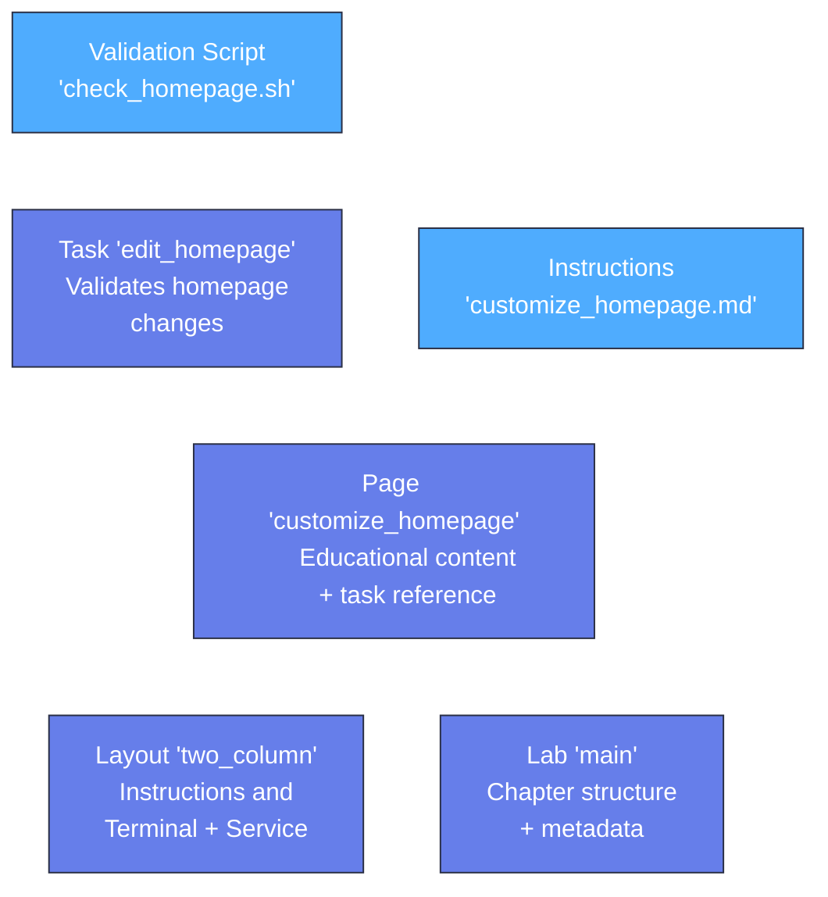

import { FileTree } from '@astrojs/starlight/components';

With your infrastructure ready, it's time to make your lab interactive. In this step, you'll create engaging content that guides learners through hands-on activities. You'll write validation scripts that check their progress, provide helpful feedback when they get stuck, and celebrate their success when they complete tasks correctly.

## Tasks vs Content

WIP

## Create Your First Interactive Task

Tasks are what make your lab interactive - they define specific activities that learners must complete, with automatic checking to verify their success. Your first task will challenge learners to customize the nginx homepage, giving them hands-on experience editing files on a web server.

Add this task definition to `tasks.hcl`:

```hcl showLineNumbers title="tasks.hcl" {1-14}
resource "task" "edit_homepage" {
  config {
    target = resource.container.webserver
  }

  condition "file_modified" {
    description = "Customize the nginx homepage with your own message"
    
    check {
      script = "scripts/check_homepage.sh"
      failure_message = "Please edit /usr/share/nginx/html/index.html with your custom message"
    }
  }
}
```

This task will target your web server container and run a validation script to check if they've made the required changes. The validation script runs inside the target container, so it has direct access to the same files and environment that learners are working with.

## Build the Validation Script

Now you'll create the actual script that checks whether learners completed the task correctly. This script uses simple bash commands to look for specific content in the nginx homepage file. If it finds the expected text, the task passes; if not, it fails with a helpful message.

Remember, this script runs inside the container, so it can directly check files that learners modified.

Create the validation script directory and file:

```bash
mkdir -p scripts
```

In VS Code, create a new file `scripts/check_homepage.sh`:

```bash showLineNumbers title="scripts/check_homepage.sh" {1-10}
#!/bin/bash

EXPECTED_MESSAGE="Hello from my web server!"
NGINX_HTML="/usr/share/nginx/html/index.html"

if grep -q "$EXPECTED_MESSAGE" "$NGINX_HTML"; then
  exit 0
else
  exit 1
fi
```

Make the script executable:

```bash
chmod +x scripts/check_homepage.sh
```

## Create Learner Instructions

Now you need to create the actual content that learners will see and follow. This includes step-by-step instructions that guide them through customizing the nginx homepage.

Create the instruction content directory:

```bash
mkdir -p instructions
```

In VS Code, create a new file `instructions/customize_homepage.md` with this content:

`````markdown title="instructions/customize_homepage.md" {1-71} wrap
# Customize Your Web Server

Web servers like nginx serve static files to visitors who access your website. When someone types your website's URL into their browser, nginx looks for an `index.html` file in its web directory and sends that content back to display in the browser.

## Understanding Web Server File Structure

Nginx stores its web files in `/usr/share/nginx/html/` by default. The main file, `index.html`, contains the HTML code that creates your homepage. Any changes you make to this file will immediately be visible to visitors since nginx serves static files directly without requiring a restart.

## Working with HTML Files

HTML (HyperText Markup Language) uses tags to structure content. You can add text, headings, paragraphs, and other elements by using HTML tags like:
- `<h1>` for main headings
- `<p>` for paragraphs  
- `<strong>` for bold text

## Editing Files on a Server

You can edit files directly on the server using command-line text editors like `nano` or `vi`. The `nano` editor is beginner-friendly:
- Navigate with arrow keys
- `Ctrl + X` to exit
- `Y` to save changes
- `Enter` to confirm the filename

To see your changes, refresh your browser or the Service tab after editing the file.

<instruqt-task id="edit_homepage">
Add the text "Hello from my web server!" to the nginx homepage.
</instruqt-task>

## Troubleshooting

**Can't find the file?**
- Make sure you're in the right directory: `/usr/share/nginx/html`
- List files with: `ls -la`

**Changes not showing?**
- Force refresh the Service tab (Ctrl+F5 or Cmd+Shift+R)
- Wait a few seconds and refresh again
`````

## Create the Layout Configuration

Layouts define how the lab's user interface is organized on screen. Multi-column layouts work well for instructional labs - learners can read instructions alongside practice areas and see results in real-time. This keeps everything visible at once, reducing the need to switch between tabs.

The layout connects to your infrastructure by referencing the terminal and service resources you created earlier.

Define the user interface with `layouts.hcl`:

```hcl showLineNumbers title="layouts.hcl" {1-24}
resource "layout" "two_column" {
  column {
    width = 50
    
    tab {
      title = "Instructions"
      type = "instructions"
    }
  }
  
  column {
    width = 50
    
    tab {
      title = "Terminal"
      terminal = resource.terminal.shell.meta.id
    }
    
    tab {
      title = "Service"
      service = resource.service.webserver.meta.id
    }
  }
}
```

This layout creates two equal-width columns (50% each):
- **Left column**: Shows the instruction content you'll create next
- **Right column**: Contains two tabs that learners can switch between:
  - Terminal tab for running commands (references your shell resource)
  - Service tab for viewing the web server (references your webserver service)

Notice how the layout uses resource chaining to connect the tabs to your infrastructure - `resource.terminal.shell.meta.id` and `resource.service.webserver.meta.id` link the UI elements to the actual resources.

## Create Page Structure

Pages are the building blocks of your lab's content. Each page is a step in your lab where learners read instructions and complete activities. This page definition ties together the markdown content and the interactive task.

Create a `pages.hcl` file to organize your content:

```hcl showLineNumbers title="pages.hcl" {1-9}
resource "page" "customize_homepage" {
  title = "Customize Your Web Server"
  content = "instructions/customize_homepage.md"
  
  activities = {
    edit_homepage = resource.task.edit_homepage.meta.id
  }
}
```

This page configuration:
- **Points to your markdown file** with the educational content (`instructions/customize_homepage.md`)
- **Connects to your task** through the activities map

The `activities` map is crucial - it tells Instruqt which tasks are available on this page. When learners see the `<instruqt-task id="edit_homepage">` component in your markdown, Instruqt knows to connect it to the actual task definition. The key (`edit_homepage`) must match the ID used in the markdown file.

## Update Your Lab Configuration

The skeleton template created a basic `main.hcl` file, but it doesn't know about all the new resources you've created. You need to update it to reference your custom layout and page so learners can access your content.

Update the skeleton's `main.hcl` to reference your new content:

```hcl showLineNumbers title="main.hcl" {4,6-14}
resource "lab" "main" {
  title = "My Web Server Lab"
  description = "Learn web server basics by customizing an nginx homepage"
  layout = resource.layout.two_column
  
  content {
    chapter "getting_started" {
      title = "Getting Started with Web Servers"
      
      page "customize_homepage" {
        reference = resource.page.customize_homepage
      }
    }
  }
}
```

This updated configuration:
- **Updates the layout reference** to use your custom two-column layout (`resource.layout.two_column`)
- **Adds a content block** with the required chapter/page hierarchy
- **Creates a chapter** called "Getting Started with Web Servers"
- **References your page** (`customize_homepage`) within the chapter

Now that you've connected all the components, let's visualize how everything works together:



This shows how your content and task components connect: the task validates learner actions, the page combines content with the task, and everything is organized through the lab's chapter structure.

## Validate Your Complete Lab

Now that you've created all the components and connected them together, it's important to validate that your complete lab configuration is correct. This checks for syntax errors, missing references, and ensures all your resource connections are properly defined.

Validate that all components work together:

```bash
instruqt lab validate
```

## Save Your Complete Lab

Your lab is now fully functional with interactive tasks and validation. Save this milestone to Git so you have a complete working version to build upon or return to if needed.

Stage all your new lab files:

```bash withOutput
> git add .
```

Create a commit documenting your complete interactive lab:

```bash withOutput
> git commit -m "Add interactive homepage customization activity"
[main def9012] Add interactive homepage customization activity
 4 files changed, 127 insertions(+)
 create mode 100644 sandbox.hcl
 create mode 100644 tasks.hcl
 create mode 100644 pages.hcl
 create mode 100644 tabs.hcl
 create mode 100644 instructions/customize_homepage.md
 create mode 100755 scripts/check_homepage.sh
```

Push your complete lab to GitHub:

```bash withOutput
> git push
```

## What You've Built

You've created a complete, interactive Instruqt lab with all the essential components:

- **Interactive task** that validates learner progress automatically using custom validation scripts
- **Educational content** with step-by-step instructions that teach web server concepts
- **Complete lab structure** connecting tasks, pages, layouts, and infrastructure through proper resource chaining
- **Professional organization** with clear separation between configuration files, content files, and validation logic

Your lab now provides a complete learning experience where learners can read instructions, complete hands-on activities, and receive immediate feedback on their progress. This represents a fully functional Instruqt lab ready for learners.

## What's Next

In the final step, you'll test your complete lab experience and learn how to deploy it to the Instruqt platform for learners to access.
