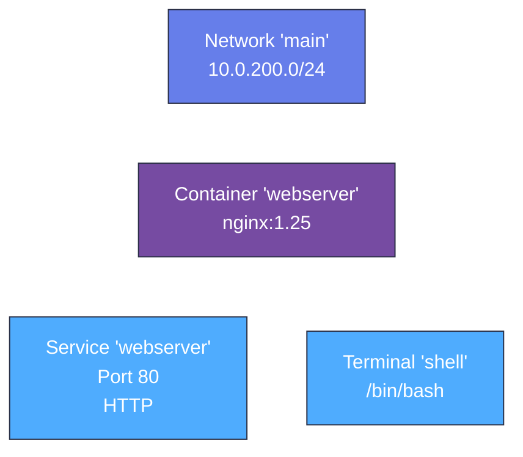

import { FileTree } from '@astrojs/starlight/components';

Now that your project structure is in place, it's time to define the infrastructure for your lab. In this step, you'll create the containers and networking that form the foundation of your learning environment. You'll also set up the user interface elements - a terminal for command-line access and a service tab to view the web server.

## Create the Infrastructure Configuration

The skeleton template doesn't include infrastructure by default, so you'll need to create it. Infrastructure in Instruqt labs starts with networking - this provides the foundation that allows containers to communicate with each other and the outside world.

You'll create a network with a private subnet that acts like a mini internet just for your lab. Think of it as creating a private Wi-Fi network that only your lab's containers can access.

Create a new file `sandbox.hcl` to define your containers and networking:

```hcl showLineNumbers title="sandbox.hcl" {1-4}
# Network - Foundation for all container communication
resource "network" "main" {
  subnet = "10.0.200.0/24"
}
```

## Resource Chaining

Resource chaining is how you connect different parts of your infrastructure together. When you create any resource such as a network, container, or service, Instruqt gives each one a unique ID. You can reference these IDs to link resources - like connecting a container to a specific network.

The syntax is simple: `resource.TYPE.NAME.meta.id` where:
- `TYPE` is the resource type (network, container, service, etc.)
- `NAME` is the name you gave the resource
- `meta.id` gets the unique identifier for that resource

For example, to connect our upcoming container to the network we just created, we'll use `resource.network.main.meta.id` to reference the network's ID.

## Add the Web Server Container

Now you'll add the actual web server that learners will interact with. This nginx container will serve web pages and provide a realistic environment for learning web server concepts. 

The container needs to connect to the network you just created (using resource chaining) and expose port 80 so learners can access the web server through their browser.

Add the nginx container that connects to your network:

```hcl showLineNumbers title="sandbox.hcl" {6-21}
# Network - Foundation for all container communication
resource "network" "main" {
  subnet = "10.0.200.0/24"
}

# Container - nginx web server with network connection
resource "container" "webserver" {
  image {
    name = "nginx:1.25"
  }

  port {
    local = 80    # Port inside the container
  }

  # Resource chaining - connect to network
  network {
    id = resource.network.main.meta.id
  }
}
```

## Create User Interface Elements

Now you need to create the interface that learners will actually see and use. This includes a service tab (so they can view the web server in their browser) and a terminal tab (so they can run commands on the server).

These UI elements connect to the infrastructure you just created - the service tab exposes the container's web server, and the terminal gives command-line access to the same container.

Create the `tabs.hcl` file to define what users will see and interact with:

```hcl showLineNumbers title="tabs.hcl" {1-12}
# Service tab - exposes the nginx web server to users
resource "service" "webserver" {
  target = resource.container.webserver
  port   = 80
  scheme = "http"
}

# Terminal tab - provides command-line access
resource "terminal" "shell" {
  target = resource.container.webserver
  shell = "/bin/bash"
}
```

Before validating your infrastructure, let's visualize how all these resources connect together:



This shows how resource chaining connects everything: the container joins the network, while the service and terminal tabs both target the container to provide user access.

## Validate Your Infrastructure

Before moving forward, it's important to check that your HCL configuration is correct. The Instruqt CLI can validate your syntax, check for missing references, and catch common configuration errors before you try to run your lab.

Test that your configuration is syntactically correct:

```bash
instruqt lab validate
```

## Commit Your Infrastructure

Now that your infrastructure is complete and validated, it's time to save this milestone to Git. This creates a snapshot of your working infrastructure that you can return to if needed, and documents your progress as you build the lab.

Stage your new infrastructure files:

```bash withOutput
> git add .
```

Create a commit with a descriptive message about your infrastructure:

```bash withOutput
> git commit -m "Add network, container, and UI infrastructure"
[main abc5678] Add network, container, and UI infrastructure
 2 files changed, 20 insertions(+)
 create mode 100644 tabs.hcl
```

Upload your infrastructure changes to GitHub:

```bash withOutput
> git push
```

## What You've Built

You've successfully created the infrastructure foundation for your lab:

- **Network infrastructure** that provides isolated networking for your lab environment
- **Container infrastructure** running nginx web server that learners will customize
- **User interface elements** including terminal access and web service viewing
- **Resource connections** demonstrating how Instruqt components link together through resource chaining

Your lab now has a complete infrastructure setup that learners can interact with. The next step is to make it truly interactive by adding educational content and validation tasks.

## What's Next

In the next step, you'll create interactive content and tasks that guide learners through hands-on activities while automatically validating their progress.
