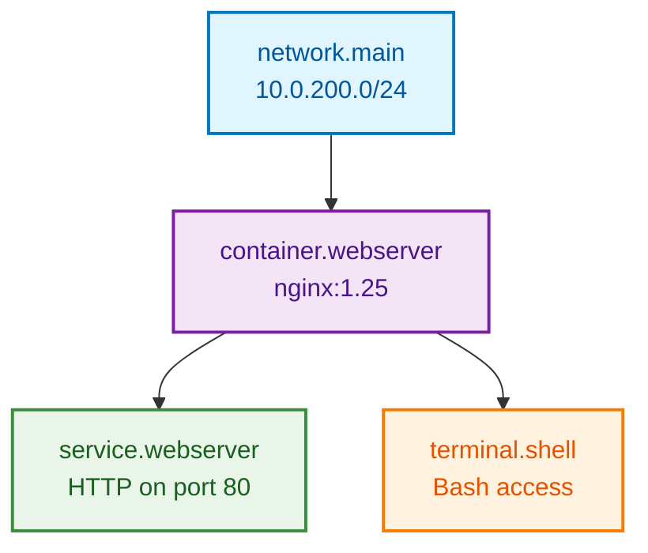

import { FileTree } from '@astrojs/starlight/components';

Build the container infrastructure that users will interact with. We'll add a `sandbox.hcl` file to define the infrastructure resources - containers, networks, and services.

## Resource Chaining

Resources reference each other to build connected infrastructure:

- Networks provide connectivity
- Containers connect to networks 
- Services expose container functionality
- Terminals provide container access

## Create the Infrastructure Configuration

The skeleton template doesn't include infrastructure by default. Create a new file `sandbox.hcl` to define your containers and networking:

```hcl showLineNumbers title="sandbox.hcl" {1-4}
# Network - Foundation for all container communication
resource "network" "main" {
  subnet = "10.0.200.0/24"
}
```

The network provides isolated communication between containers. The subnet `10.0.200.0/24` provides 254 IP addresses (10.0.200.1 to 10.0.200.254).

## Add the Web Server Container

Add the nginx container that connects to your network:

```hcl showLineNumbers title="sandbox.hcl" {6-21}
# Network - Foundation for all container communication
resource "network" "main" {
  subnet = "10.0.200.0/24"
}

# Container - nginx web server with network connection
resource "container" "webserver" {
  image {
    name = "nginx:1.25"
  }

  port {
    local = 80    # Port inside the container
  }

  # Resource chaining - connect to network
  network {
    id = resource.network.main.meta.id
  }
}
```

Key concepts:

- **Image**: Official nginx 1.25 container
- **Port mapping**: Exposes container port 80
- **Network reference**: `resource.network.main.meta.id` connects to the network
- **Resource chaining**: Container references the network resource

## Create User Interface Elements

Create the `tabs.hcl` file to define what users will see and interact with:

```hcl showLineNumbers title="tabs.hcl" {1-12}
# Service tab - exposes the nginx web server to users
resource "service" "webserver" {
  target = resource.container.webserver
  port   = 80
  scheme = "http"
}

# Terminal tab - provides command-line access
resource "terminal" "shell" {
  target = resource.container.webserver
  shell = "/bin/bash"
}
```

Tab definitions:

- **Service tab**: Web browser panel showing the nginx homepage
- **Terminal tab**: Command-line access to the container
- **Target references**: Both reference the same container

## Visualize the Resource Relationships

Your infrastructure now has these connections:



## Validate Your Infrastructure

Test that your configuration is syntactically correct:

```bash
instruqt lab validate
```

If the command reports errors:
- Read the error message - it will tell you exactly what's wrong
- Common issues:
  - Unclosed braces `{}`
  - Invalid resource references (check exact format: `resource.type.name.meta.id`)
  - Mixed tabs and spaces in indentation

## Commit Your Infrastructure

Save your progress to version control:

```bash withOutput
> git add .
```

```bash withOutput
> git commit -m "Add network, container, and UI infrastructure
> - Network: 10.0.200.0/24 subnet for container communication
> - Container: nginx:1.25 web server with port 80 mapping  
> - Service: HTTP access to web server
> - Terminal: Bash shell access to container
> - Resource chaining: network -> container -> tabs"
[main abc5678] Add network, container, and UI infrastructure
 2 files changed, 20 insertions(+)
 create mode 100644 tabs.hcl
```

```bash withOutput
> git push
```

## What You've Built

- Network with 10.0.200.0/24 subnet for container communication
- nginx web server container connected to the network
- Service tab exposing the web server on port 80
- Terminal tab providing bash shell access to the container
- Resource chaining connecting network → container → services


## What's Next

With solid infrastructure in place, you're ready to add interactivity. In the next step, you'll:

- Create challenges that users must complete
- Add validation scripts that check progress automatically
- Build content that guides users through the learning experience
- Connect tasks to your infrastructure components

The infrastructure you've built provides the foundation for rich, interactive learning experiences.

